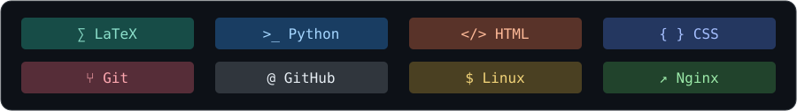

<div align="center">

# ✨ Leon 的个人空间


<a href="https://github.com/Leon5428?tab=overview">
  
</a>

<!-- Refresh the calendar before committing: python WebCode/update_contributions.py -->

[📐 Math](https://github.com/Leon5428/Leon5428/tree/HEAD/Math) · [🔐 Crypto](https://github.com/Leon5428/Leon5428/tree/HEAD/Crypto) · [🧩 Project](https://github.com/Leon5428/Leon5428/tree/HEAD/Project) · [🔬 Research](https://github.com/Leon5428/Leon5428/tree/HEAD/Research) · [🛠 Tool](https://github.com/Leon5428/Leon5428/tree/HEAD/Tool) · [✍ Diary](https://github.com/Leon5428/Leon5428/tree/HEAD/Diary)

*Keep learning, keep exploring.*

</div>

## 👋 Hello

大家好，我是 **Leon**，目前就读于山东大学网络空间安全学院密码科学与技术专业，同时辅修数学学院金融数学专业，热爱数学，励志成为一名密码行业从业者！

但是我并不是一个有天赋的人，理解力也不是很好，只能一遍遍重复来学习各种各样的数学知识，这也是这个仓库存在的意义：不仅仅是为了展示我的成果，更是为了见证我过去走过的路。

- 📖 **正在学习**：有限域、隐私计算、密码分析学。
- 🔐 **关注方向**：全同态加密、分组密码。
- 🏗 **正在搭建**：[LeonBlog](https://leon.wiki)，一个以 LaTeX 为内容源的个人知识网站。
- ✍ **喜欢做的事**：把学过的知识再讲给自己听，也把卡住过的地方写下来。
- 💬 **欢迎交流**：另一种证明思路、笔记勘误，或一个值得继续追问的问题。

> 我希望记录的不只有结论，还有走到结论之前的疑问、尝试，以及后来才想明白的地方。

## 🧰 Toolbox

**正在使用和学习的工具。** 

<p align="center">
  
</p>


## 🚀 Action

<p align="center"><b>写下一点，弄懂一点，再向前走一点。</b></p>

<!-- Dynamic cards show Leon5428's public GitHub data. Language charts describe repositories, not proficiency. -->
<p align="center">
  <a href="https://github.com/Leon5428?tab=overview">
    
  </a>
</p>
<p align="center">
  
  
</p>

<details>
<summary>📊 关于这些统计</summary>

卡片展示 GitHub 公开活动，语言分布反映仓库构成。很多学习发生在提交之前：阅读、演算、推翻一个思路，再重新开始。

统计图片由 [GitHub Profile Summary Cards](https://github.com/vn7n24fzkq/github-profile-summary-cards) 提供；若暂时无法加载，可以直接查看我的 [GitHub 活动](https://github.com/Leon5428?tab=overview)。

</details>

## 🌌 My Knowledge Universe

这里按学科整理知识，也给项目、研究和生活留出位置。

<table>
<tr>
<td width="33%" valign="top">
<h3>📐 Math</h3>
<p>从公理、定义到结构与证明。记录推导，也记录那些“为什么”。</p>
<a href="https://github.com/Leon5428/Leon5428/tree/HEAD/Math">阅读数学笔记 →</a>
</td>
<td width="33%" valign="top">
<h3>🔐 Crypto</h3>
<p>探索安全背后的数学。从秘密共享出发，学习密码学与隐私计算。</p>
<a href="https://github.com/Leon5428/Leon5428/tree/HEAD/Crypto">阅读密码学笔记 →</a>
</td>
<td width="33%" valign="top">
<h3>🧩 Project</h3>
<p>把想法变成可以运行的东西。目前在持续搭建和完善 LeonBlog。</p>
<a href="https://github.com/Leon5428/Leon5428/blob/HEAD/WebCode/BUILD.md">了解网站构建 →</a>
</td>
</tr>
<tr>
<td valign="top">
<h3>🔬 Research</h3>
<p>为更深入的问题留一块地方。方向还在探索，内容逐步积累。</p>
<a href="https://github.com/Leon5428/Leon5428/tree/HEAD/Research">研究记录 →</a>
</td>
<td valign="top">
<h3>🛠 Tool</h3>
<p>工欲善其事，必先利其器。从 LaTeX 开始整理自己的学习工具箱。</p>
<a href="https://github.com/Leon5428/Leon5428/tree/HEAD/Tool">工具与教程 →</a>
</td>
<td valign="top">
<h3>✍ Diary</h3>
<p>公式与代码之外，记录日常、阅读，以及成长中的一些想法。</p>
<a href="https://github.com/Leon5428/Leon5428/tree/HEAD/Diary">日常片段 →</a>
</td>
</tr>
</table>

## 📌 Featured Notes

| 笔记 | 从这里开始 |
| :--- | :--- |
| [有限域及其应用](https://github.com/Leon5428/Leon5428/tree/HEAD/Math/M11-FiniteFieldsAndTheirApplications) | 群、环、域与多项式：定义、证明和理解过程。 |
| [逻辑和证明](https://github.com/Leon5428/Leon5428/blob/HEAD/Math/M04-DiscreteMathematics/01-logic-and-proofs.tex) | 命题、量词与推理：把“为什么成立”说清楚。 |
| [集合与函数](https://github.com/Leon5428/Leon5428/blob/HEAD/Math/M04-DiscreteMathematics/02-sets-and-functions.tex) | 集合、映射与基数：从有限走向无限。 |
| [门限密码](https://github.com/Leon5428/Leon5428/blob/HEAD/Crypto/C04-PrivacyCalculation/01-ThresholdCryptography.tex) | 为什么不能简单地把密钥切成几份？ |
| [LaTeX 安装与配置](https://github.com/Leon5428/Leon5428/blob/HEAD/Tool/T01-Latex/00-installation-and-configuration.tex) | 给刚开始使用 LaTeX 的同学的一份入门说明。 |

## 🏗 Behind LeonBlog

我希望做一个能长期维护的知识网站：文章按学科组织，公式清楚，源码可以追溯，笔记能够随着理解一起成长。

这个仓库既是我的个人主页，也是网站的源码所在。`.tex` 保存文章，`meta.json` 组织目录，`build.py` 将它们变成静态页面。

<details>
<summary>🔎 展开看看网站的结构</summary>

```text
LeonBlog/
├── Math/        数学笔记
├── Crypto/      密码学笔记
├── Project/     项目记录
├── Research/    研究记录
├── Tool/        工具与教程
├── Diary/       日常与思考
├── WebCode/     模板、样式与静态资源
└── build.py     静态网站构建入口
```

生成的 `Output/` 不提交到仓库。构建与预览方法见 [BUILD.md](https://github.com/Leon5428/Leon5428/blob/HEAD/WebCode/BUILD.md)。

</details>

## 🤝 Let's Connect

如果某段证明让你产生了不同的想法，或者有一步还可以解释得更清楚，欢迎留下来一起讨论。

**[提出问题 / 笔记勘误](https://github.com/Leon5428/Leon5428/issues) · [参与修订](https://github.com/Leon5428/Leon5428/pulls) · [浏览我的仓库](https://github.com/Leon5428?tab=repositories)**

---

<div align="center">

### ✦ Per Aspera Ad Astra ✦

循此苦旅，以达天际。

**道阻且长，行则将至。**

<sub>Thanks for visiting. See you in the next proof, note, or commit.</sub>

</div>
